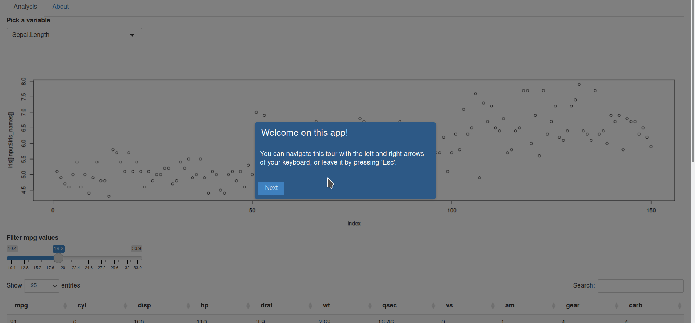

# Demo

Below is a general demo of a `Conductor` tour. It shows several features
and options that are detailed in the other sections of the
documentation: \* different element types (inputs, tabs, etc.) \*
customizing with CSS \* tabs \* custom buttons

(Code below the gif)



``` r
library(conductor)
library(DT)
library(shiny)

conductor <- Conductor$
  new()$
  step(
    title = "Welcome on this app!",
    text = "You can navigate this tour with the left and right arrows of your keyboard, or leave it by pressing 'Esc'.",
    buttons = list(
      list(
        action = "next",
        text = "Next"
      )
    )
  )$
  step(
    el = "[data-value='Analysis']",
    title = "On this tab, you can see plots and tables."
  )$
  step(
    el = ".selectize-input",
    "Choose the variable to plot",
    "You can only pick one variable."
  )$
  step(
    "The chosen variable will be plotted here",
    el = "#plot_iris"
  )$
  step(
    el = ".irs--shiny",
    "Same thing for mtcars",
    "Slide this to filter the dataset 'mtcars' based on 'mpg' value."
  )$
  step(
    el = "#mtcars_table",
    "This is the filtered table"
  )$
  step(
    el = "#DataTables_Table_0_filter",
    "This allows you to search the table."
  )$
  step(
    el = "[data-value='About']",
    "Get more info about the app",
    "This tab is less important: it contains technical info about the app.",
    tab = "Analysis",
    tabId = "main-tabset"
  )$
  step(
    el = "p.description",
    "This is the technical info",
    tab = "About",
    tabId = "main-tabset"
  )$
  step(
    "I hope this was useful. Enjoy!",
    tab = "Analysis",
    tabId = "main-tabset",
    buttons = list(
      list(
        action = "back",
        secondary = TRUE,
        text = "Previous"
      ),
      list(
        action = "next",
        text = "Finish"
      )
    )
  )

ui <- fluidPage(
  useConductor(),
  tabsetPanel(
    id = "main-tabset",
    tabPanel(
      title = "Analysis",
      selectizeInput("iris_names", "Pick a variable", names(iris)),
      plotOutput("plot_iris"),
      sliderInput("mtcars_values", "Filter mpg values", min = min(mtcars$mpg),
                  max = max(mtcars$mpg), value = median(mtcars$mpg)),
      dataTableOutput("mtcars_table")
    ),
    tabPanel(
      title = "About",
      br(),
      br(),
      p("Hi this is the description of the app.", class = "description")
    )
  ),
  tags$head(
    tags$style(
      HTML(
        "
        .shepherd-header {
          background-color: #2d5986 !important;
        }
        .shepherd-element {
          background-color: #2d5986;
        }
        .shepherd-title {
          color: white
        }
        .shepherd-text {
          color: white
        }
        .shepherd-button {
          background-color: #4080bf 
        }
        
        .shepherd-button-secondary {
          background-color: #204060 !important;
          color: white !important;
        }
        
        .shepherd-footer {
          margin-top: 2rem;
          display: flex;
          justify-content: space-between;
        }
        
        .shepherd-arrow:before {
          background-color: #2d5986 !important;
        }
        "
      )
    )
  )
)

server <- function(input, output, session){
  conductor$init()$start()
  
  output$plot_iris <- renderPlot({
    plot(iris[[input$iris_names]])
  })
  
  output$mtcars_table <- renderDataTable({
    subset(mtcars, mpg > input$mtcars_values)
  })
  
}

shinyApp(ui, server, options = list(launch.browser = TRUE))
```
